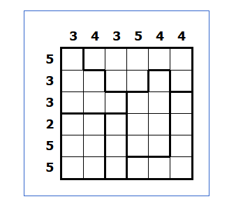
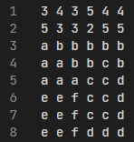
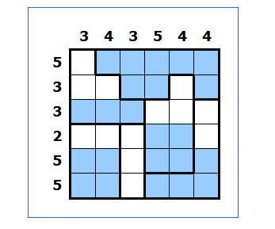

# SAT solver

This is a project I did some semesters ago for the SAT solver lab. The task was to  develop a SAT solver for a puzzle and after that try to generate some own puzzles. I have chosen the [aquarium](https://www.puzzle-aquarium.com/) puzzle. Since we wanted to develop a simple program, we as course decided to use python as the programming language. For the Boolean satifiability (SAT) solver we used the [PySAT](https://pysathq.github.io/) package which provides some state of the art SAT solvers.

The task of this puzzle is to fill the aquarium with water. The entire puzzle is divided into blocks which are called "aquariums". An aquarium can't have air in a row with water or in the row under the water. The numbers on the top and on the left side tell how much water fields must be in a column / row. These together with the aquariums form the constraints for the SAT solver. For translating the puzzle in a usable format I used the following approach:

The first line contains the the column constraints. The second line contains the row constraints and after that the aquariums are written down with a lowercase letter for each aquarium from a, ..., z. For a larger puzzle I would have had to work again with the letters a, ..., z but that would have had the risk that in a very unfortunate case, two aquariums with the same letter could then be adjacent to each other. This would lead to wrong constraints. To avoid that i decided to not use the normal alphabet again instead use aa, ..., zz and so on. These file can be read form the program which will solve it if it's possible. It will print the solved puzzle and the required times (in seconds) of the solvers to the console. There would have been also a lot of other possible approaches to represent the puzzle. The solved puzzle looks as follows:

# Puzzle generation

Typing the puzzles from hand in the needed file format wasn't a nice way for larger puzzles. Besides that the puzzles were to small for the SAT solvers since nearly all solvers solved them in under a second even the really big ones. So self generated puzzles allow me to scale the size and difficulty of the puzzles. The name of the puzzle and the size needs to be specified when **puzzle.generatePuzzle(name, size)** is called in the main method. For the aquariums I decided to use the letter a followed by a number 1, ..., n for each aquarium instead of my initial approach with the entire alphabet. This had mainly advantages in the implementation, the functionality is the same. To determine the size of the generated aquariums I used two random numbers. The first one was to decide wether to continue the aquarium of the current line or start a new one. The second one was to decide wether the aquarium from the line above is continued or a new one is started. The percentage limits for this were determind by trial and error. The same applies to the number of water fields.